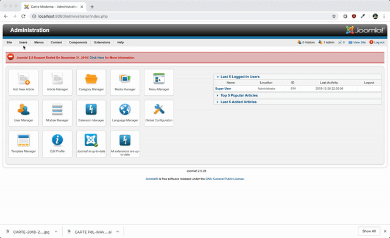

# Installation de la Carte Modema HTML5 dans un article Joomla 2.5.28

## Support
- Joomla 2.5.28 (besoin d'essayer sur 2.5.7)
- PHP5.6

## Étapes
1. Changement temporairement l'éditeur par défaut pour permettre l'implémentation des balises `<style>` et `<svg>` dans l'article.
    1. Aller dans le panneau d'administration 
        - http://VOTRE_SITE.com/administrator/
    2. Aller dans le panneau "Configuration Globales" (Site > Global Configuration)
        - http://VOTRE_SITE.com/administrator/index.php?option=com_config
    3. Changer l'éditeur par défaut "Editor - TinyMCE" par "Editor - None"
    4. Sauvegarder et fermer

2. Modification de l'article contenant la carte MODEMA.
    1. Aller dans le Gestionnaire des articles (Content > Article Manager) 
        - http://VOTRE_SITE.com/administrator/index.php?option=com_content
    2. Cliquer sur le titre de l'article contenant la carte à remplacer
    3. Supprimer tout dans le champ de texte de l'article
    4. Placer le code de la carte MODEMA HTML5 (code disponible dans `carte.html`)
    5. Sauvegarder et fermer
    6. Vérifier si la carte est fonctionnelle 

## (OPTIONNEL) Reproductibilité
### Prérequis
- docker, docker-compose
### Installation
1. Lancer la commande `docker-compose up -d` à la racine du dossier.
2. Sur votre navigateur, entrez l'url suivante: http://localhost:8080/
3. Installer Joomla
    1. JOOMLA_DB_HOST: joomladb
    3. JOOMLA_DB_USER: root
    2. JOOMLA_DB_PASSWORD: example
4. Procéder à l'installation de la carte (voir plus haut)